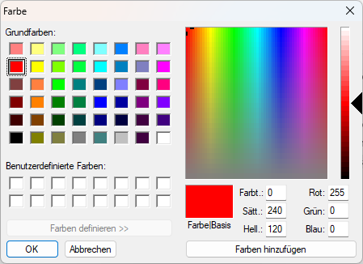

# MK212 DriveGlow


A tiny dependency-free Windows tray application that uses the **side light of
the OMOTON MK212 keyboard** as a classic disk activity indicator.

The key backlight is left untouched. The application talks directly to the
keyboard's VIA/QMK-compatible HID interface and restores the previous side-light
settings when it exits normally.



## Features

- Warm amber flash on disk read/write activity
- Dedicated tray icon that mirrors the activity state
- Native Windows color picker with live preview
- Optional activity-level mode that maps disk throughput to brightness
- Tray status showing whether the MK212 is connected
- Optional automatic start when signing in to Windows
- Automatic reconnect when the keyboard is unplugged and connected again
- Periodically reasserts the selected side-light color if another RGB application overwrites it
- No drivers, services, administrator rights, or third-party libraries
- Restores the previous side-light effect, color, speed, and brightness on exit

## Requirements

- Windows 10 or Windows 11
- OMOTON MK212 (`VID 36B0`, `PID 3142`)
- Wired or receiver mode exposing the VIA HID interface (`Usage Page FF60`)
- .NET Framework 4.x, included with supported Windows installations

## Install

1. Download `MK212-DriveGlow.exe` from the latest release.
2. Put it in a permanent folder.
3. Run:

   ```powershell
   .\MK212-DriveGlow.exe --install
   ```

The application starts immediately and registers itself for the current user's
Windows sign-in. Its drive-shaped icon appears in the notification area and a
startup notification points to it. Windows may initially place the icon in the
overflow menu; drag it from there onto the taskbar to keep it visible.

Right-click the icon to inspect its status, choose the indicator color with an
immediate preview on the keyboard, enable
or disable automatic start, or exit and restore the previous lighting state.

## Uninstall

Run:

```powershell
.\MK212-DriveGlow.exe --uninstall
```

Then delete the executable.

## Test without installing

```powershell
.\MK212-DriveGlow.exe --test
```

The side light flashes four times and is then restored.

## Build

No SDK or package restore is required. On 64-bit Windows, run:

```text
build.cmd
```

The executable is written to `dist/` using the C# compiler included with the
.NET Framework. `build.cmd` applies the execution-policy override only to this
single build process and does not change the system policy.

## SignalRGB and other RGB applications

The application periodically reasserts its selected side-light color so that
occasional VIA writes from SignalRGB or another RGB application do not leave the
activity indicator in the wrong color. If another application continuously
controls the MK212 at a high update rate, both programs can still compete and
cause flickering. Excluding the MK212 from the other application remains the
cleanest solution when that option is available.

## Technical notes

The official MK212 VIA definition exposes the side light on custom channel `4`:

- value `1`: brightness
- value `2`: effect
- value `3`: effect speed
- value `4`: HSV color

The program sends volatile VIA custom-value commands and deliberately does not
save the activity flashes to the keyboard EEPROM.

Disk activity is sampled through Windows PDH using the language-independent
English counter `PhysicalDisk(_Total)\Disk Bytes/sec`.

## License

[MIT](LICENSE)
