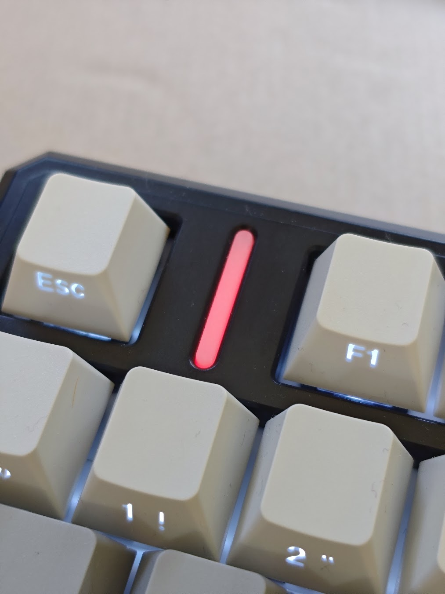
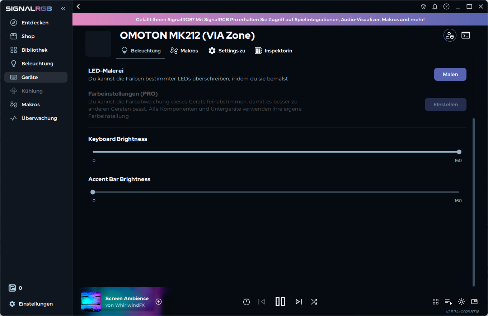

# MK212 DriveGlow


A tiny dependency-free Windows tray application that uses the **side light of
the OMOTON MK212 keyboard** as a classic disk activity indicator.

The key backlight is left untouched. The application talks directly to the
keyboard's VIA/QMK-compatible HID interface and restores the previous side-light
settings when it exits normally.

<p align="center">
  
</p>

<p align="center"><em>The MK212 side light acting as a classic disk activity indicator.</em></p>


## Features

- Warm amber flash on disk read/write activity
- Dedicated tray icon that mirrors the activity state
- Selectable tray display: activity point, five-step level meter, or static icon
- Optional native Windows taskbar activity meter with a compact status window
- Native Windows color picker with live preview
- Optional activity-level mode that maps disk throughput to brightness
- Tray status showing whether the MK212 is connected
- Optional automatic start when signing in to Windows
- Automatic reconnect when the keyboard is unplugged and connected again
- Periodically reasserts the selected side-light color if another RGB application overwrites it
- No drivers, services, administrator rights, or third-party libraries
- Restores the previous side-light effect, color, speed, and brightness on exit

## Requirements

- Windows 10 or Windows 11
- OMOTON MK212 (`VID 36B0`, `PID 3142`)
- Wired or receiver mode exposing the VIA HID interface (`Usage Page FF60`)
- .NET Framework 4.x, included with supported Windows installations

## Install

The recommended option is `MK212-DriveGlow-Setup-v1.2.1.exe`. It installs for
the current user without administrator rights, adds a Start menu shortcut, and
offers to start DriveGlow automatically when signing in to Windows.

For portable use:

1. Download `MK212-DriveGlow.exe` from the latest release.
2. Put it in a permanent folder.
3. Run:

   ```powershell
   .\MK212-DriveGlow.exe --install
   ```

The application starts immediately and registers itself for the current user's
Windows sign-in. Its drive-shaped icon appears in the notification area and a
startup notification points to it. Windows may initially place the icon in the
overflow menu; drag it from there onto the taskbar to keep it visible.

Automatic startup uses a shortcut in the current user's Windows Startup folder.
Older registry-based startup entries are migrated automatically and repaired if
the executable has moved. Run `MK212-DriveGlow.exe --repair-startup` to recreate
the shortcut manually if an older installation does not start.

Right-click the icon to inspect its status, choose the indicator color with an
immediate preview on the keyboard, enable
or disable automatic start, or exit and restore the previous lighting state.

The **Tray display** submenu independently selects an activity point, a
five-step level meter, or a static application icon. The optional **Activity in
the taskbar** item creates a dedicated DriveGlow taskbar button whose native
Windows progress indicator follows disk activity. Clicking the button opens a
compact window with the current percentage. This option is disabled by default.

## Uninstall

Installer users can remove DriveGlow normally from **Installed apps** in Windows
Settings. For the portable version, run:

Run:

```powershell
.\MK212-DriveGlow.exe --uninstall
```

Then delete the executable.

## Test without installing

```powershell
.\MK212-DriveGlow.exe --test
```

The side light flashes four times and is then restored.

## Build

No SDK or package restore is required. On 64-bit Windows, run:

```text
build.cmd
```

The executable is written to `dist/` using the C# compiler included with the
.NET Framework. `build.cmd` applies the execution-policy override only to this
single build process and does not change the system policy.

Building the setup executable additionally requires
[Inno Setup 6](https://jrsoftware.org/isinfo.php). Run `build-installer.cmd`; the
result is written to `dist/` alongside the portable executable.

## SignalRGB and other RGB applications

The application periodically reasserts its selected side-light color so that
occasional VIA writes from SignalRGB or another RGB application do not leave the
activity indicator in the wrong color. If another application continuously
controls the MK212 at a high update rate, both programs can still compete and
cause flickering. Excluding the MK212 from the other application remains the
cleanest solution when that option is available.

For SignalRGB, the MK212 does not need to be disabled completely. Open
**Devices → OMOTON MK212 (VIA Zone) → Lighting** and set
**Accent Bar Brightness** to `0`. SignalRGB can continue controlling the key
backlight and the rest of the RGB setup, while DriveGlow retains control of the
accent bar without flickering—even with rapidly changing screen-ambience or
video effects.

<p align="center">
  
</p>

## Technical notes

The official MK212 VIA definition exposes the side light on custom channel `4`:

- value `1`: brightness
- value `2`: effect
- value `3`: effect speed
- value `4`: HSV color

The program sends volatile VIA custom-value commands and deliberately does not
save the activity flashes to the keyboard EEPROM.

Disk activity is sampled through Windows PDH using the language-independent
English counter `PhysicalDisk(_Total)\Disk Bytes/sec`.

## Possible QMK/GPL compliance issue

The MK212 is advertised as QMK/VIA compatible, and OMOTON provides a VIA JSON
definition on its [official download page](https://omoton.com/collections/keyboard-mouse).
As of September 15, 2026, however, we have not been able to locate the complete
corresponding source code for the firmware shipped with the keyboard.

The QMK project states that firmware based on QMK, or firmware incorporating
QMK/VIA firmware code, must make the complete source code for the shipped
firmware available under the GPL. See QMK's official
[license-violation guidance](https://github.com/qmk/qmk_firmware/blob/master/docs/license_violations.md)
and [GPLv2 license text](https://github.com/qmk/qmk_firmware/blob/master/license_GPLv2.md).
If the MK212 firmware contains such code and no corresponding source is made
available, this may represent a GPL compliance violation. This is not a legal
determination. If an official source release exists, please open an issue with
the link so this notice can be corrected.

MK212 DriveGlow is an independent host-side application and contains no copied
keyboard firmware code.

## License

[MIT](LICENSE)
